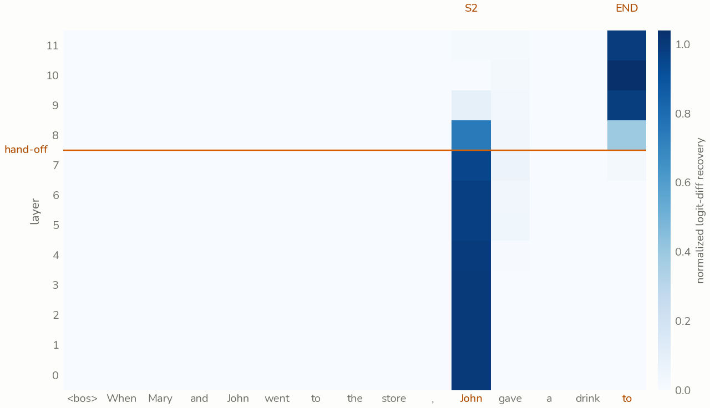

<!-- GENERATED by tools/home/build.py from tools/resume/resume.toml — do not edit. Regenerates on every quarto render (pre-render hook). -->

```{=html}
<section class="cv" id="top">

  <div class="cv-hero">
    <div class="cv-stage" aria-hidden="true"></div>
    <p id="hero-headline" class="cv-ident" role="heading" aria-level="1">Ameya Panchal</p>
    <p class="cv-title"><span>CS, physics &amp; AI at Penn State.</span><span>Independent interpretability research.</span></p>
    <p class="cv-now">My neutron-star paper is in peer review, and I am transitioning into AI safety research in mechanistic interpretability. Currently I am developing measures for internal monitoring when a model&#x27;s chain of thought becomes illegible.</p>
  </div>

  <div class="cv-road">
    <div class="cv-eras">
      <div class="cv-spine" aria-hidden="true"></div>
      <p class="cv-road-label" aria-hidden="true">The road</p>

      <div class="cv-era">
        <p class="cv-when"><small>SEP</small>2026</p>
        <p class="cv-name" role="heading" aria-level="2">SPAR<span class="cv-tag">Current</span></p>
        <p class="cv-role">Mentored research, with two fellow mentees</p>
        <p class="cv-what">Do residual-stream probes survive degrading chain-of-thought legibility? Testing whether classifiers on a model&#x27;s internal activations still catch harmful reasoning as its written reasoning degrades.</p>
      </div>

      <div class="cv-era">
        <p class="cv-when"><small>JUL</small>2026</p>
        <p class="cv-name" role="heading" aria-level="2">Independent research<span class="cv-tag">Ongoing</span></p>
        <p class="cv-role">Mechanistic interpretability</p>
        <p class="cv-what">Circuits and lenses in GPT-2, Pythia, Qwen3 and Gemma-2, with PyTorch and TransformerLens. Every figure regenerates from a public repository.</p>
        <ul class="cv-work">
          <li><a href="posts/jlens-offset/"><strong>The J-lens offset is the model&#x27;s token frequency</strong><em>Subtracting it hurts; z-scoring it helps</em></a></li>
          <li><a href="posts/induction-head/"><strong>An induction head in disguise</strong><em>Chasing grammar in a character-level transformer</em></a></li>
        </ul>
        <details class="cv-more">
          <summary>More</summary>
            <ul class="cv-work">
              <li><a href="notes/dead-relu-collapse/"><span class="cv-thumb is-blank"></span><strong>A dead-ReLU absorbing state</strong><em>Why one architecture in a memorization challenge barely learns</em></a></li>
              <li><a href="posts/ioi-circuit/"><strong>Every method has a blind spot</strong><em>Reading GPT-2&#x27;s IOI circuit three ways</em></a></li>
              <li><a href="notes/statue-with-reflexes/"><span class="cv-thumb is-blank"></span><strong>A statue with reflexes</strong><em>Cloning an expert taught the policy to walk, not where</em></a></li>
            </ul>
        </details>
      </div>

      <div class="cv-era">
        <p class="cv-when"><small>JUN</small>2026</p>
        <p class="cv-name" role="heading" aria-level="2">Penn State Multi-Campus REU</p>
        <p class="cv-role">Undergraduate researcher, advised by Prof. Asif ud-Doula</p>
        <p class="cv-what">The paper in peer review today started here: X-ray photons scattering through a neutron star&#x27;s atmosphere, simulated to measure the error a common assumption introduces. First author, under review at <em>Astrophysics and Space Science</em>.</p>
        <ul class="cv-work">
          <li><a href="posts/where-the-error-hides/"><strong>Where the error hides</strong><em>The isotropy bias in neutron-star pulse profiles</em></a></li>
        </ul>
      </div>

      <div class="cv-era">
        <p class="cv-when"><small>FEB</small>2026</p>
        <p class="cv-name" role="heading" aria-level="2">CrashAI<span class="cv-tag">Current</span></p>
        <p class="cv-role">Founder &amp; technical lead, team of three</p>
        <p class="cv-what">A crash-risk analysis platform: a crash-severity model with per-site explanations and what-if simulation. First of 40 teams at the Nittany AI Challenge 2026.</p>
      </div>

      <div class="cv-era">
        <p class="cv-when"><small>DEC</small>2025</p>
        <p class="cv-name" role="heading" aria-level="2">Nittany AI Advance</p>
        <p class="cv-role">Application specialist, team of five · through April 2026</p>
        <p class="cv-what">An OCR, LLM and regex pipeline that extracts metadata from scanned project documents, for Penn State&#x27;s Office of the Physical Plant.</p>
      </div>

      <div class="cv-era">
        <p class="cv-when"><small>AUG</small>2024</p>
        <p class="cv-name" role="heading" aria-level="2">The Pennsylvania State University<span class="cv-tag">Current</span></p>
        <p class="cv-role">B.S. Computer Science, minors in Physics and AI</p>
        <p class="cv-what">Schreyer Honors College. Expected May 2028.</p>
      </div>
    </div>

    <div class="cv-end">
      <p>End of the road, for now.</p>
      <p>Thanks for walking it with me.</p>
    </div>
  </div>

  <nav class="cv-foot" aria-label="Profile links">
    <a href="#top">Back to start</a>
    <a href="about/">About</a>
    <a href="https://github.com/Ameya-bit">GitHub</a>
    <a href="https://www.linkedin.com/in/ameya-bit">LinkedIn</a>
    <a href="mailto:ameyapanchal011@gmail.com">Email</a>
    <a href="resume/">Résumé</a>
  </nav>
</section>
```
