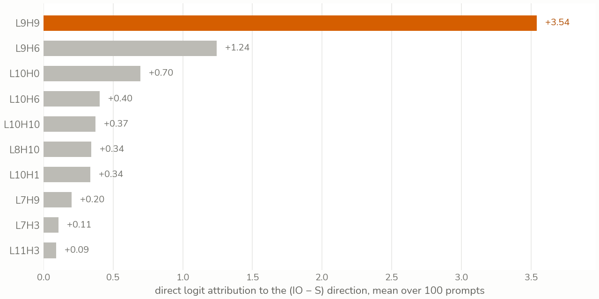
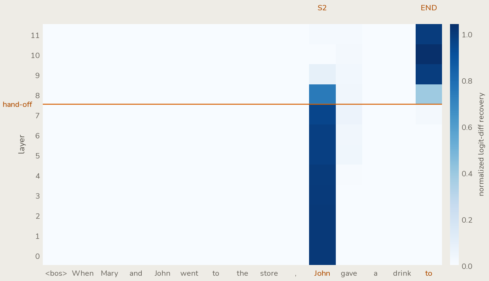
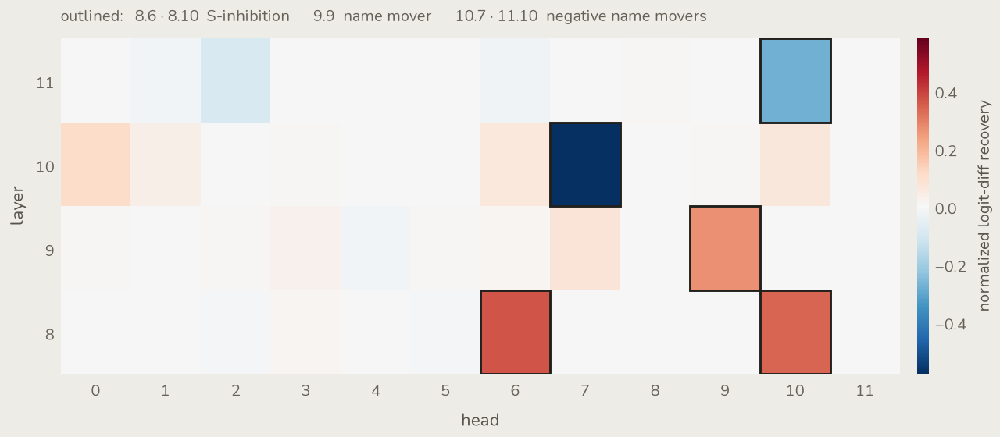
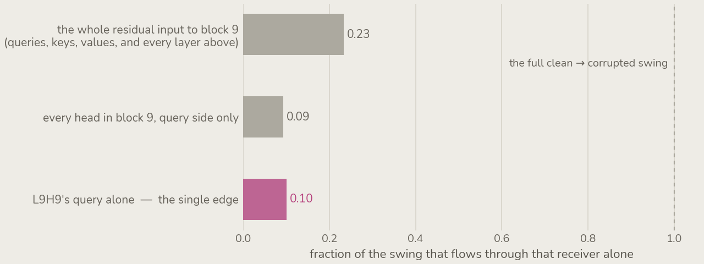
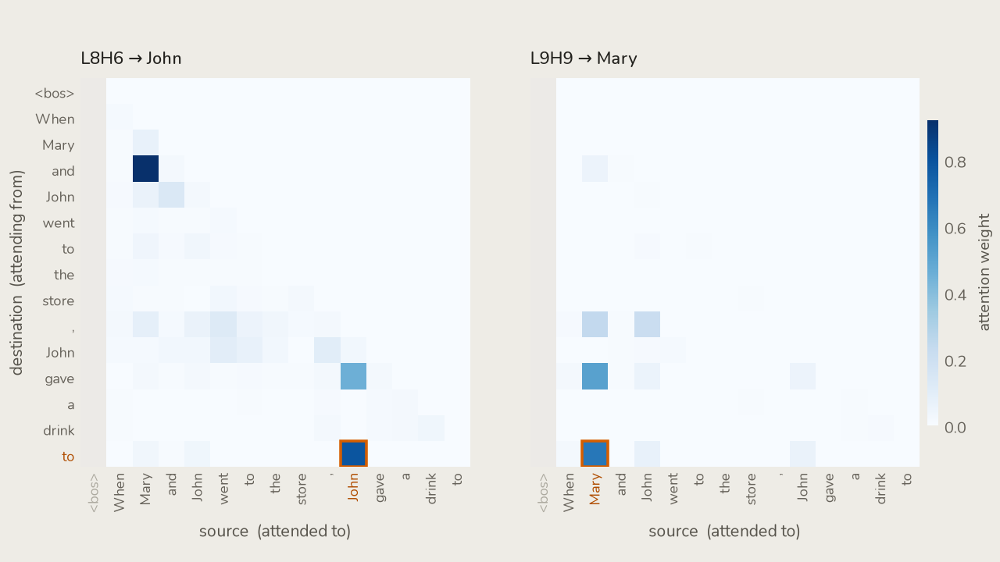
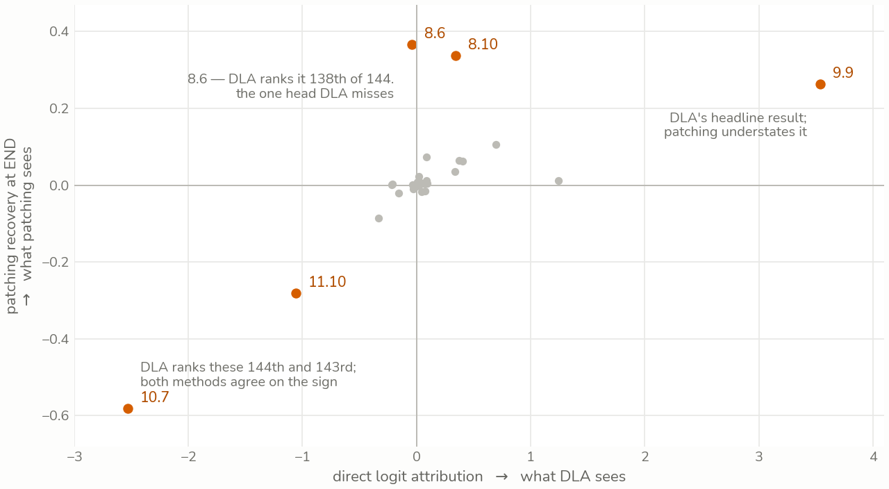

::: {.epistemic}
*Confident in the measurements — logit differences, recovery grids, attention patterns, all reproducible from the four notebooks in the [repo](https://github.com/Ameya-bit/IOI). More exploratory where I read a circuit off a disagreement between methods. My second mechanistic interpretability post; corrections welcome — one of my own is in section 4.*
:::

Stack three interpretability methods on the same circuit and the temptation is to read their agreement as confirmation.

The agreement is real. But the sharper signal is in the disagreement: each method reads one part of the circuit cleanly and is blind to the part the next one is built to see.

This post walks the same GPT-2 circuit through direct logit attribution, activation patching, and path patching. The through-line isn't "I replicated IOI." It's what each method saw, and what it couldn't.

The last post took a copying head apart from the *weights* — eigenvalues of an OV circuit, input-independent structure. This one works from the other side: activations, what a specific input actually produces.

That seam runs underneath everything here, and it shows up in the first result.

## The task and the metric

The vehicle is Indirect Object Identification. Given

> When Mary and John went to the store, John gave a drink to ___

the model should predict the indirect object `Mary` over the repeated subject `John`.

Every run is scored by one number, the **logit difference** at the answer position,

$$\Delta = \operatorname{logit}(\text{IO}) - \operatorname{logit}(\text{S}) .$$

On that prompt $\Delta = +3.36$. Across a hundred length-matched prompts built from the same template it averages $+3.52$, at 99% accuracy. GPT-2 small solves this cleanly; the question is *how*.

Causal traction needs a corruption — a minimal edit that flips the answer. The one used throughout is the **S2 swap**: change the second `John` to `Mary` (*"…the store, Mary gave a drink to"*), which makes `John` the intended answer and drives $\Delta$ to $-2.48$.

Everything downstream is measured as **normalized recovery** against those two poles,

$$\text{recovery} = \frac{\Delta_{\text{patched}} - \Delta_{\text{corrupted}}}{\Delta_{\text{clean}} - \Delta_{\text{corrupted}}} ,$$

so $0$ means the intervention did nothing and $1$ means it fully restored clean behaviour.

One metric, three ways of attributing it.

## Direct logit attribution

The cheapest question first. Which heads write *directly* into the logit difference?

DLA decomposes the residual stream at the answer position into per-component contributions. Each head's output goes back through its $W_O$, takes the final LayerNorm scaling, and projects onto the answer direction $W_U[:,\text{IO}] - W_U[:,\text{S}]$.

No interventions, one forward pass, and the per-head projections sum back to the total $\Delta$ — a clean ranking of direct responsibility.

**The name-mover head L9H9 dominates at $+3.54$, with L9H6 a distant second at $+1.24$.** Everything else is noise by comparison.



On the single hand-written prompt, though, L9H6 and L9H9 come out nearly tied — $+2.11$ against $+2.10$. Averaging is what separates them, which is the first hint that one prompt is a shaky place to read a circuit.

Here is the seam with the last post. In the weights-only view a head's copying strength is the copying score, and by that metric L9H9 scores **0.26** — near the bottom of all 144 heads, while genuine high-copiers like L11H3 sit at $1.00$.

The weight-only reading would have walked right past the single most important head in the circuit.

The copying score measures *copies what it attends to*, not *attends to the right thing*. DLA finds L9H9 precisely because it folds in the actual attention on this input. Structure in the weights is not the same as structure that gets used.

What DLA cannot do is see anything that doesn't write straight to the logits. A head whose whole contribution is routed through L9 scores zero here no matter how much work it is doing.

The chart is also only the top of a ranking. Sorted descending it cannot show the other end of the list, and the other end turns out to matter — the last section comes back to what that hid.

To find the upstream heads at all, the measurement has to become causal.

## Activation patching

Activation patching runs the corrupted prompt but splices a single clean activation back in, one location at a time, and scores the recovery.

Where DLA sees only direct writes, this catches components whose effect is routed through later layers. The price is a forward pass per location instead of one for the whole model.

The first sweep patches the residual stream across every `(layer, position)`. It answers a question no static weight reading can even phrase: not just *where* the answer-relevant information lives, but *when*.



The signal lives at position 10 — the second, repeated subject — through the early layers, then goes dark above layer 8. At the same depth it reappears at the END token and stays lit to the top.

The handoff is the whole story. Early layers carry the answer information at the repeated-name position; around **layer 8 it migrates to END** and rides the residual stream out to the logits.

That is a *temporal* claim, information living in one place and then another, and it is the clearest thing patching buys over reading weights — which can only ever describe a static map of what a head *could* do.

Averaging over a hundred prompts barely smears the map. That looked like a broken experiment until it didn't: the circuit is stable enough that one prompt and a hundred draw the same picture.

The second sweep localizes heads. Patch each head's output at the END position and measure recovery.



The brightest cells are not the name movers. S-inhibition heads L8H6 and L8H10 light up hardest at $+0.37$ and $+0.34$; the name mover L9H9 is positive but dimmer at $+0.26$. L10H7 goes strongly negative at $-0.58$ and L11H10 mildly so — the negative name movers, heads that push *against* the answer.

The name mover reading dimmer is not it mattering less.

Denoising one of several redundant name movers understates it, because the others cover for it — self-repair. The S-inhibition signal, by contrast, is exactly what the S2 corruption flips, so patching reads it at full strength.

This is where the methods start to disagree in a way that's informative rather than annoying. DLA read the name movers cleanly and scored L8H6 at $-0.04$. Patching makes L8H6 the brightest cell on the grid and *understates* the name movers.

Neither is wrong. Each is bright exactly where its own machinery is sensitive.

Put them side by side and you get the roster the paper predicts: **S-inhibition at L8H6 and L8H10, name movers around L9H9, negative name movers at L10H7 and L11H10.**

But patching localizes *nodes*. It tells you L8 matters and L9 matters. It does not tell you that L8 matters *by talking to L9* — that the edge between them is real, and not two independent contributions that happen to co-occur.

For that you have to hold everything else still.

## Path patching

Path patching isolates a single **sender → receiver** edge. The hypothesis, handed up by the previous two sweeps, is that the S-inhibition heads feed the name mover.

Testing it took the most care of anything here. My first attempt quietly rebuilt plain activation patching, because patching the sender and reading the output lets its effect flow down *every* path, not the one edge I wanted.

The real construction freezes everything. Run clean and corrupted, caching both. Then re-run with **every head and MLP frozen to its clean value except the sender** — L8H6, set to corrupted — so the sender's effect propagates and nothing else moves.

Grab what that delivers to block 9 and stash it. In a final clean run, patch only the stashed value back in and score.

Freezing everything but the sender is what turns a node measurement into an edge measurement. What decides *which* edge is how narrowly the receiver is defined, and that turns out to matter more than I first gave it credit for.



Take block 9's whole residual input as the receiver and $0.23$ of the swing comes back. But that number is not an edge: it routes the sender into layer 9's keys and values as well as its queries, and into everything layers 10 and 11 read downstream.

Narrow the receiver to the query side and the story sharpens. Every head's query in block 9 recovers $0.09$; **L9H9's query alone recovers $0.10$.**

So essentially the whole query-side effect of L8H6 on block 9 travels down the one L8H6 → L9H9 wire. The other eleven heads' queries add nothing net — very slightly less than nothing, which is why the all-head bar sits a hair below the single-head one.

That is the thing DLA had to ignore and node patching could only assume: a measured edge, not a co-occurrence.

::: {.epistemic}
*Revised 2026-08-03. The first version of this post reported $0.24$ against $0.10$ here and read the gap as the rest of the name-mover family carrying half the composition. That was wrong. The $0.24$ was measured into block 9's whole residual input and the $0.10$ into one head's query — two different kinds of intervention, so the difference between them was never attributable to anything, least of all to heads the second measurement had excluded. Holding the receiver type fixed and narrowing it is the comparison above, and it says something stronger than the original claim did.*
:::

## Verification

Head numbers matching a paper's head numbers proves nothing on its own. If the labels are right, the attention patterns should show each head reading what its name claims.



L8H6's END row puts its weight on ` John`, the repeated subject. An S-inhibition head reads the duplicated name; that is what it is for.

L9H9's END row attends to ` Mary`, the indirect object — the answer. The name mover copies the correct name to the output position.

Together the panels trace the edge path patching measured: L8H6 reads the repeat, L9H9 writes the answer.

The BOS column is the honest caveat, and in the first version of these figures it was also the loudest thing in them. Averaged across rows the attention sink soaks up $0.74$ of L8H6's mass and $0.86$ of L9H9's, and none of it is about the task.

So it is masked here, and the colour scale runs over the remaining fourteen columns.

That is an editorial choice, not a neutral one — masking a column makes a real signal easier to see and a wishful one easier to over-read. With the discount applied and stated, the labels hold. 8.6 reads the subject, 9.9 writes the object, and the circuit the three methods reconstructed is the circuit the attention shows.

## Four views, one circuit

Nothing here contradicts anything else. The methods agree on the answer.

What they don't share is their blind spots, and lining those up is the actual result. Both per-head measurements ran on the same hundred prompts, so the claim can be plotted rather than asserted.

```{=html}
<!-- The lens figure. Same heads, same hundred prompts, one grid — switch the
     instrument and watch which heads the instrument can see. Data is generated
     from _data.npz by figures/make_lens_data.py; behaviour is
     assets/site/ioi-lens.html; styling is styles.scss. With JS off the
     <noscript> below keeps the static scatter, which makes the same claim. -->
<figure class="ioi-lens-figure">
  <div id="ioi-lens" class="ioi-lens" hidden></div>
  <noscript>
    
  </noscript>
  <figcaption>
    Every head in layers 8–11, under both instruments, on the same hundred
    prompts. Hover or arrow-key a cell to read it; switch the lens to change
    what the grid is measuring. Outlined cells are the heads the IOI paper
    names. Watch <span class="lens-callout">L8H6</span>: nearly invisible under
    direct logit attribution, the brightest cell on the grid under patching.
  </figcaption>
</figure>
```



Drawing this corrected something I had been assuming, so the sharper version of the claim is worth stating plainly.

DLA is not blind to upstream or negative heads in general. Of the five heads the paper names, it ranks **L9H9 1st, L10H7 144th, L11H10 143rd and L8H10 6th** out of 144 — four of five, found at one end of the list or the other.

Exactly one head is invisible to it: **L8H6, ranked 138th at $-0.04$, and the strongest cell in the entire patching sweep at $+0.37$.**

That is the disagreement, and it is a single point on the chart rather than a region. A top-ten bar chart sorted descending is what made it look like a pattern — it cannot show the bottom of the list, so the negative name movers went missing from section 2 and I read their absence as a property of the method.

The blind spot is narrower than "DLA misses what feeds the name movers". It is specifically the head whose entire contribution is routed through L9 and none of which lands on the answer direction.

| Method | Gives you | Blind to |
|---|---|---|
| **Weights** (last post) | input-independent structure | what a given input actually uses |
| **Direct logit attribution** | direct contribution to the logits | anything routed through later layers |
| **Activation patching** | causal importance, and a *temporal* story | the wiring between components |
| **Path patching** | the sender → receiver edge | nothing above — but it is the easiest to build wrong |

Read top to bottom, each row's blind spot is the next row's headline.

Weights miss what's used. DLA finds what's used but only at the output. Patching finds the upstream heads but not their wiring. Path patching supplies the wiring.

The copying score buried L9H9; DLA surfaced it but couldn't see L8; patching surfaced L8 but couldn't prove it feeds L9; path patching drew the edge.

You don't get the circuit from any single method. You get it from knowing what each one can't tell you, and reaching for the one that can.

::: {.epistemic}
*The four notebooks are in the [repo](https://github.com/Ameya-bit/IOI). Every number and figure above is reproducible on CPU from `compute.py` and `plot.py` alongside the figures in this post's source.*
:::
