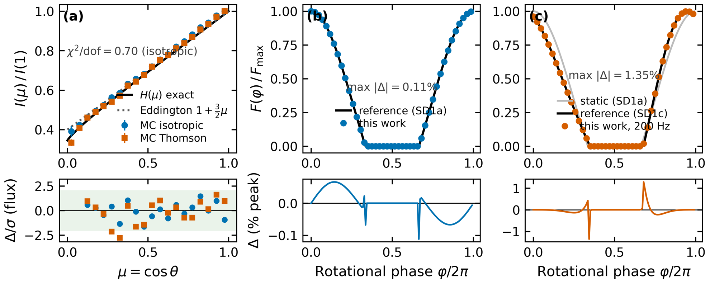

::: {.epistemic}
*Confident in the engine and the numbers — the transport reproduces Chandrasekhar's H function, the pulse machinery matches published reference waveforms to 0.11%, and every figure regenerates from the [repo](https://github.com/Ameya-bit/mc-radiative-transfer)'s committed pipeline. The work was done in Penn State's Multi-Campus REU under Dr. Asif Ud-Doula; a manuscript is in preparation, so none of this is peer-reviewed yet. There is also a [poster](https://sites.psu.edu/mcreu/2026/07/21/where-the-error-hides-how-a-common-assumption-biases-pulse-fraction-for-neutron-stars/) and a [recorded talk](https://psu.mediaspace.kaltura.com/media/t/1_mj89w444/381609352) covering the same results. My first physics post here.*
:::

NASA's NICER telescope weighs neutron stars by watching them blink.

A millisecond pulsar carries hot spots on its surface, and as the star spins those spots swing toward and away from us. The X-ray flux rises and falls — a **pulse profile** — and because the star's gravity bends the light, the *shape* of that profile encodes the star's mass and radius. Fitting pulse profiles is how NICER produced its landmark mass–radius measurements, which are among the tightest constraints we have on what matter does at densities no lab can reach.

Buried in many of those fits is a simplifying assumption: that the surface glows equally brightly in every direction. **Isotropic emission.** A real scattering atmosphere doesn't do that — light escaping straight up passes through less plasma than light escaping at a grazing angle, so the surface beams.

This project measures what that shortcut costs.

## The simulation

The engine is a Monte Carlo radiative transfer code I wrote from scratch: X-ray photons injected at the base of a Thomson-scattering slab atmosphere, followed scatter by scatter until they escape or are reabsorbed. Recording the escape angles of millions of photons builds the **beaming function** $I(\mu)$ — brightness as a function of $\mu = \cos\theta$, the emission angle.

That beaming function then feeds a general-relativistic pulse-profile calculation: exact Schwarzschild light bending (the standard ~1% linear approximation turned out to be a 2σ bias on the final number, so it was replaced with the exact ray integral), rotational Doppler boosting, and light-travel delay.

Both halves are validated against theory before either is trusted. The transport reproduces Chandrasekhar's exact $H(\mu)$ solution with residuals inside ±2σ ($\chi^2/\text{dof} = 0.70$), and the pulse machinery matches published reference waveforms to a maximum deviation of 0.11% static and 1.35% rotating at 200 Hz.

Every run is scored by one number: the **pulsed fraction**,

$$\mathrm{PF} = \frac{F_{\mathrm{max}} - F_{\mathrm{min}}}{F_{\mathrm{max}} + F_{\mathrm{min}}} ,$$

how deeply the star's light curve breathes. The systematic under test is the difference between modeling the same star both ways,

$$\Delta \mathrm{PF} = \mathrm{PF}_{\text{real}} - \mathrm{PF}_{\text{iso}} .$$

## The headline number

The first anchor is PSR J0740+6620, the most massive precisely-weighed neutron star known, with published hot-spot geometries from both NICER analysis teams.

**Swapping isotropic emission for the Monte Carlo beaming function shifts the pulsed fraction by $+0.137 \pm 0.003$ under the Riley geometry and $+0.195 \pm 0.005$ under Miller's** — static, bolometric, at optical depth $\tau = 10$. The shift saturates above $\tau \approx 3$, so it is not a fine-tuned choice of atmosphere thickness.

For a quantity that lives between 0 and 1, a bias of +0.14 is not a rounding error. It is the kind of number that moves a fit.

## The zero that wasn't

The second anchor, PSR J0030+0451, was supposed to be a second data point on the same line. Instead it returned $\Delta \mathrm{PF} = 0.00$. Exactly zero, under both teams' geometries.

The first reading of a perfect zero is a bug. It isn't one: J0030's geometry eclipses each spot completely at some rotational phase, so the flux floor hits zero, both pulsed fractions pin to 1, and their difference is *identically* zero — the observable saturates. **The error hasn't gone away; the meter has railed.**

And the bias is still there, one measurement over: the isotropic and realistic waveforms disagree in shape by an RMS of ~6% of peak flux for both geometries.

The result that looked like nothing turned out to be the finding. It reframed the question from *how big is the error?* to *where does the error show up?*

## A rule for the geometry

Two stars is an anecdote. Sweeping the engine over all two-spot geometries — spot colatitude against azimuthal separation, at each anchor's spacetime — turns the anecdote into a rule.

**The dividing line is tiling: whether the two spots' visibility windows overlap enough to keep the summed flux off zero at every phase.** Where they do, the pulsed fraction stays unsaturated and the bias appears in $\Delta\mathrm{PF}$. Where they don't, the flux floor hits zero, PF saturates, and the bias moves into waveform shape. An analytic visibility boundary, derived independently of the Monte Carlo engine, lands exactly on the numerical transition.

Both J0740 geometries sit on the live side. Both J0030 geometries sit in the saturated region. Neither star is special — they are two samples of one map.

## Spin re-routes the error

One hiding place found, a second suspected. J0740 spins at 346.5 Hz — its spots move at about 0.13c, and Doppler boosting reshapes the profile. Turning the real spin on collapses the headline: $+0.137 \to +0.037$ under Riley's geometry, $+0.195 \to +0.061$ under Miller's, and restricting to NICER's energy band compresses it further, to $+0.019$ and $+0.045$.

A model comparison at real spin rates would conclude the isotropy assumption barely matters. **But the waveform-shape difference — RMS ≈ 0.10 of peak — does not move.** It is invariant to spin, to the energy band, and to light-travel delay, through every convention tested.

Same lesson as J0030, by a different mechanism. Geometry hid the error by saturating the meter; spin hides it by shrinking the one number a pulsed-fraction comparison would check. Both times it reappears in the waveform's shape.

## What survives

The obvious attacks on the headline are measured, and none of them land. Replacing the beaming curve's noisy grazing-angle tail with a physically-motivated one shifts $\Delta\mathrm{PF}$ by ≤ 0.006 — at the seed-to-seed error bar. Swapping the entire atmosphere model for Eddington and Chandrasekhar limb-darkening laws reproduces the sign and size. Giving the spots realistic finite extent moves the number by −0.003.

So the claim that survives its controls: **the isotropy shortcut carries a persistent, quantifiable bias, and no measured condition removes it — geometry and spin only decide whether it appears in the pulsed fraction or in the waveform's shape.** A fit that checks pulsed fraction alone can be told the assumption is safe by the very mechanism that is hiding the error.

The pulse profiles NICER actually fits are waveform shapes, at real spin rates, for stars on both sides of the tiling boundary. Which is to say: the error lives exactly where the field does its measuring.

::: {.epistemic}
*If this held your attention, the [symposium talk](https://psu.mediaspace.kaltura.com/media/t/1_mj89w444/381609352) walks the same argument aloud over the [poster](https://sites.psu.edu/mcreu/2026/07/21/where-the-error-hides-how-a-common-assumption-biases-pulse-fraction-for-neutron-stars/), and the [repo](https://github.com/Ameya-bit/mc-radiative-transfer) reproduces every number from `pytest` up. The manuscript in preparation extends the phase diagram and the atmosphere-law comparison.*
:::
