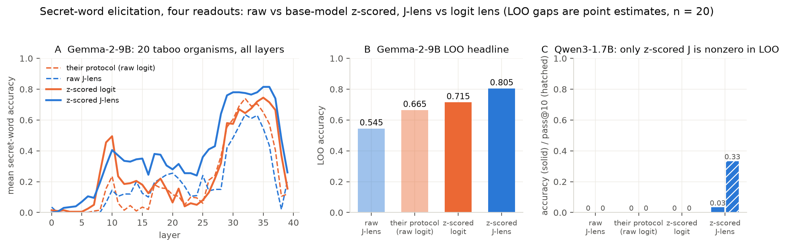
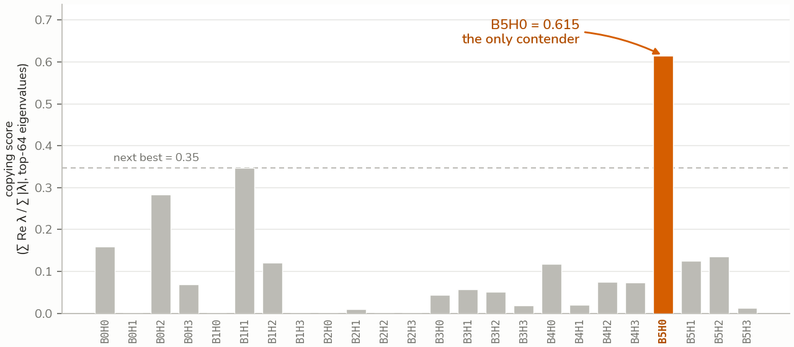
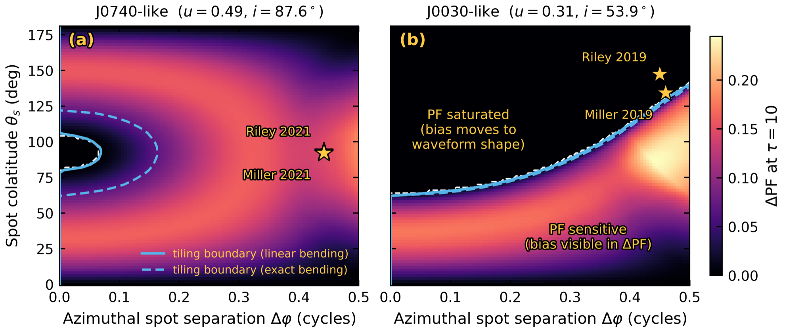

<!-- GENERATED by tools/resume/build.py from resume.toml — do not edit. Regenerates on every quarto render (pre-render hook). -->

```{=html}
<p class="cv-filing">Updated September 2026</p>
<nav class="cv-pdfs" aria-label="Download the résumé">
  <a class="cv-pdf" href="../assets/Ameya_Panchal_Resume.pdf">Research<small>PDF</small></a>
  <a class="cv-pdf" href="../assets/Ameya_Panchal_Resume_Engineering.pdf">Engineering<small>PDF</small></a>
  <a class="cv-pdf" href="../assets/Ameya_Panchal_CV.pdf">CV<small>PDF</small></a>
</nav>
```

## Education

```{=html}
<div class="cv-road">
<article class="cv-entry">
  <p class="cv-when"><span>EXPECTED</span><span>MAY 2028</span></p>
  <p class="cv-head">The Pennsylvania State University</p>
  <p class="cv-detail">B.S. Computer Science, Minors in Physics and AI · Schreyer Honors College · GPA 3.71 / 4.00 <span class="cv-where">· University Park, PA</span></p>
</article>
</div>
```

## Research Experience

```{=html}
<div class="cv-road">
<article class="cv-entry is-running">
  <p class="cv-when"><span>SEP 2026</span><span>– NOW</span></p>
  <p class="cv-head">Do Residual-Stream Probes Survive Degrading Chain-of-Thought Legibility?</p>
  <p class="cv-detail">SPAR · mentored by Marios Tsatsos, with two fellow mentees · PyTorch</p>
  <ul class="cv-points">
    <li>Finding borderline prompts to train an activation probe on, and replicating chain-of-thought illegibility</li>
    <li>Testing what current chain-of-thought monitors miss, before settling on the project&#x27;s direction</li>
  </ul>
</article>
<article class="cv-entry has-thumb">
  <p class="cv-when"><span>AUG 2026</span><span>– SEP 2026</span></p>
  <a class="cv-thumb" href="../posts/jlens-offset/" tabindex="-1" aria-hidden="true"></a>
  <p class="cv-head"><a href="../posts/jlens-offset/">The J-lens offset is the model&#x27;s token frequency: z-scoring helps</a></p>
  <p class="cv-detail">Independent · PyTorch, jacobian-lens · Qwen3, Pythia, GPT-2, Gemma-2</p>
  <ul class="cv-points">
    <li>Traced the per-token bias in a lens that reads a large language model&#x27;s internal activations as words to the model&#x27;s own word frequency (Spearman <b class="cv-fig">0.48</b>); subtracting it made readouts <b class="cv-fig">3.5–7×</b> <em>worse</em></li>
    <li>Replaced subtraction with z-scoring: recovered hidden secret words from fine-tuned models where the published method scored zero, and beat it <b class="cv-fig">0.805</b> to <b class="cv-fig">0.665</b> on Gemma-2-9B</li>
  </ul>
</article>
<article class="cv-entry">
  <p class="cv-when"><span>JUL 2026</span></p>
  <p class="cv-head"><a href="../notes/dead-relu-collapse/">A Dead-ReLU Absorbing State — Resolving an Open Memorization Anomaly</a></p>
  <p class="cv-detail">Independent · PyTorch · <em>LessWrong</em></p>
  <ul class="cv-points">
    <li>Explained why one small transformer in a published memorization challenge could barely learn: its ReLU units died in training and cut off the gradient, a training failure, not a capacity limit</li>
    <li>Confirmed it with one controlled experiment (a bias after the hidden layer restored full capacity, <b class="cv-fig">1024</b> facts; before it, none, <b class="cv-fig">488</b>) and hand-built weights storing <b class="cv-fig">672</b> facts; <em>overturned</em> the authors&#x27; explanation</li>
  </ul>
</article>
<article class="cv-entry has-thumb">
  <p class="cv-when"><span>JUL 2026</span></p>
  <a class="cv-thumb" href="../posts/induction-head/" tabindex="-1" aria-hidden="true"></a>
  <p class="cv-head"><a href="../posts/induction-head/">An Induction Head in Disguise — Circuit Analysis of a Character-Level Transformer</a></p>
  <p class="cv-detail">Independent · PyTorch, TransformerLens · <em>LessWrong</em></p>
  <ul class="cv-points">
    <li>Trained a 6-layer character-level transformer on Nietzsche&#x27;s prose and located the one attention head that copies earlier text forward</li>
    <li><em>Ruled out</em> two hypotheses about the head (quotation and parenthesis matching) with targeted controls</li>
    <li>Found the head had learned half of a bracket-matching mechanism: it knows what to write, but never learned where to look</li>
  </ul>
</article>
<article class="cv-entry has-thumb">
  <p class="cv-when"><span>OCT 2025</span><span>– AUG 2026</span></p>
  <a class="cv-thumb" href="../posts/where-the-error-hides/" tabindex="-1" aria-hidden="true"></a>
  <p class="cv-head"><a href="../posts/where-the-error-hides/">Systematic Bias from Assuming Isotropic Surface Emission in Neutron-Star Pulse-Profile Modeling</a></p>
  <p class="cv-detail">Penn State Multi-Campus REU · advised by Prof. Asif ud-Doula · Python</p>
  <ul class="cv-points">
    <li>Simulated X-ray photons scattering through a neutron star&#x27;s atmosphere to measure the error a common assumption introduces</li>
    <li>Validated it against an exact analytic solution (reduced χ² = <b class="cv-fig">0.70</b>) and published waveforms (<b class="cv-fig">0.11%</b> peak error)</li>
    <li>Showed the error shifts between two observables; first-author paper under review at <em>Astrophysics and Space Science</em></li>
  </ul>
</article>
</div>
```

## Experience

```{=html}
<div class="cv-road">
<article class="cv-entry">
  <p class="cv-when"><span>DEC 2025</span><span>– APR 2026</span></p>
  <p class="cv-head">Nittany AI Advance Internship Program</p>
  <p class="cv-detail">Application Specialist · Team of 5 · Client: Penn State Office of the Physical Plant <span class="cv-where">· State College, PA</span></p>
  <ul class="cv-points">
    <li>Built a Tesseract OCR + LLM + regex pipeline that extracts metadata (project name, ID, and more) from scanned project documents</li>
    <li>Raised extraction accuracy up to <b class="cv-fig">10%</b> by merging the LLM and regex paths and moving from GPT-4o to GPT-5 after benchmarking Azure&#x27;s 4- and 5-series models; parallelized the pipeline for <b class="cv-fig">5x</b> faster runs</li>
  </ul>
</article>
</div>
```

## Projects

```{=html}
<div class="cv-road">
<article class="cv-entry is-running">
  <p class="cv-when"><span>FEB 2026</span><span>– NOW</span></p>
  <p class="cv-head">CrashAI — Crash-Risk Analysis Platform</p>
  <p class="cv-detail">Founder &amp; Technical Lead · Team of 3 · 1st of 40 teams, Nittany AI Challenge 2026 · Scoped with PennDOT</p>
  <ul class="cv-points">
    <li>Built a crash-severity model (XGBoost, <b class="cv-fig">81</b> road and driver features) with per-site explanations and what-if simulation; led a team building a 33-tool agent, retrieval over engineering manuals, and an eval harness</li>
  </ul>
</article>
</div>
```

## Skills

```{=html}
<p class="cv-skill"><strong>Machine Learning</strong> Python, PyTorch, HuggingFace Transformers, TransformerLens, NumPy, scikit-learn, Monte Carlo simulation, Git</p>
<p class="cv-skill"><strong>Mechanistic Interpretability</strong> Circuits, OV/QK analysis, activation and path patching, direct logit attribution, Jacobian and logit lenses</p>
```
